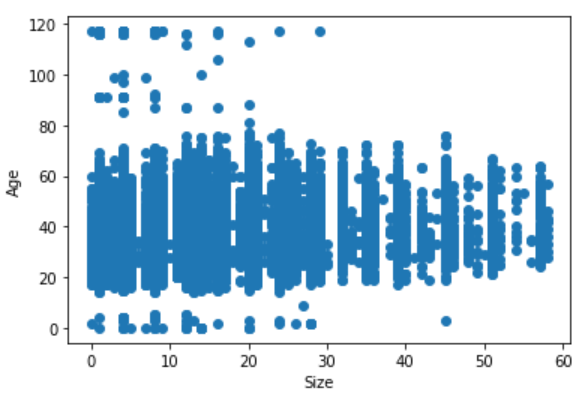
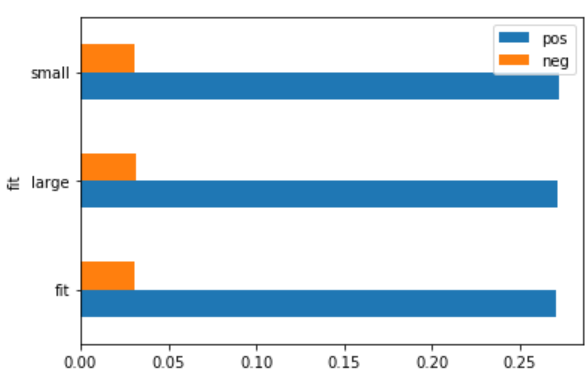

# Recommenders with Clothing Data

### Executive Summary

The problem I wanted to solve was creating a recommender with Rent the Runway data I had found. Rent the Runway is a company that has a service where people can rent clothing and return it. The data I found had variables in the data that allowed me to create a recommender.
What is a recommender? A recommender is an algorithm that can take data based on either a user or an item and give recommendations to a person about another item they may like. There are many ways to build recommenders, and what ultimately matters is the kind of data that is collected on the front end in order to give people a certain kind of recommendation after they have come to your site. For example, when someone walks into a store for the first time or sits down at a restaurant for the first time it is impossible to give a recommendation to that person because you have no history of who they are and what they like, but the more times they frequent a place they more you get to know their likes and dislikes. This is how recommenders can work when it comes to building one online. The more times a user visits a website or creates an account the more a company can get to know a user and collect data on their likes in order to give them recommendations that can increase sales on a website.

### Exploring the Data

When it comes to exploring the data, first I always check to see how much of the data is missing. This is usually the first step because I can’t start exploring the data in other ways until I know how much of it exists.
Once I did this, I created scatterplots to see where some of the outliers are, and of course came to find that people are not the best at always getting their own information correct. There were some ages that were way over 100, which I expect most of them were typos.

Then I decided to create different kinds of visualization in Tableau to get a better understanding of the average type of customer that Rent the Runway has.

[Link to Tableau Graphic](https://public.tableau.com/profile/raven.hinson#!/vizhome/RTRRecommenderVisualizations/Sheet2)

Next I decided to perform sentiment analysis on the reviews that customers left of the clothes to see how customers felt about Rent the Runway overall. What I found was that there was not really any one variable where people felt more negatively about the clothes than any others. I thought the variable where someone could select how well a product fit them would show that people who choose large or small would give more negative reviews but I did not find this to be the case.

### Creating the Recommender
After assessing the data I downloaded about Rent the Runway, I looked to see what kind of data I had in order to understand the kind of recommender I could build. I was able to create an Item-Item recommender as well as a User-User recommender because I had a ratings variable, user-id variable and item-id variable.
In order to explain the different types of recommenders, I need to explain how the recommenders I created operate. For the recommenders I used you need either a user-id or an item-id as well as the type of item and the rating of that item. Ratings are the most important part of recommenders because they help us to understand how much a user liked something, but they are not necessarily what the only variable in data that can tell us how much a user may like something. For now though, in ratings are important because to create a recommender a sparse matrix needs to be created meaning that either the item rating or user rating is used to make the recommender and they are compared against each other using the cosine values. Basically what needs to be understood here is that if a value is one then they have the most similarity, and it means they share everything in common. The user will definitely like this recommendation. On the opposite end the least amount a value can be is negative one and this can tell you that the user will definitely not like this product. But if the value is close to zero or is zero, this does not give away much information because we would not be sure as to whether the customer would like this item or not.
So what is an Item-Item recommender? It is when you take the item ids and use them to create a recommender along with the rating and the product name. A User-User recommender is the same as an Item-Item recommender except that it uses user-id instead of the item-id. But which is better to use? From the reading [this article](https://medium.com/datadriveninvestor/how-to-built-a-recommender-system-rs-616c988d64b2), I read that Item-Item recommenders are better for two reasons. One if you have a lot of users it can take a long time to run a user-user recommender, and two users tastes change of time, so you could only pull on recent data that you have about the user, whereas the rating of an item doesn’t so much change. Generally products tend to have the same status over time, and it does not really change. Because of this item-item recommenders are much better. A case in which a user-user recommender might be better is when you have fewer products and more users.

But what if you do not know anything about a user, and it is their first time on a website? The best thing to do in this case is to recommend products that are rated highly over all and then as you learn more based on what the customer chooses then you can change to using a recommender system for making suggestions on purchases. I created a non-personal recommender that the notebook labeled Non-personal recommender.  

### Conclusion
In conclusion, I came to find in my research that there are many types of recommender systems out there, and that you can make different kinds of recommender systems based on the variables you have in the data. You have to know what kind of data you need ahead of time to make these recommenders, so it is good collect all kinds of information about purchases that your users make. For example, if I had data that allowed me to view which items were bought together I could have made a Frequently Bought Together Recommender (FTB).

### Acknowledgements

[Book I referenced](https://www.manning.com/books/practical-recommender-systems)
